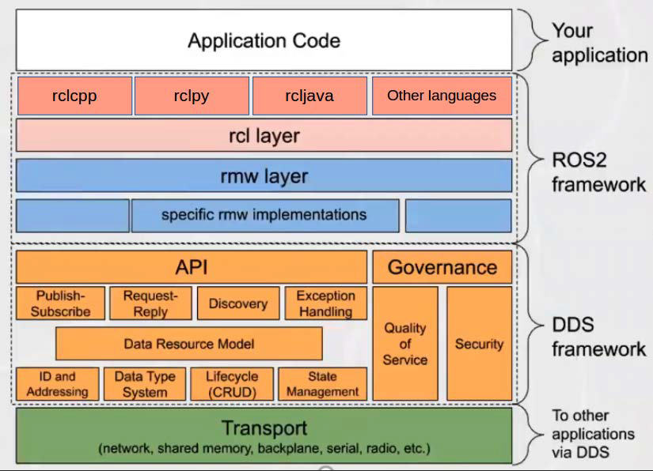
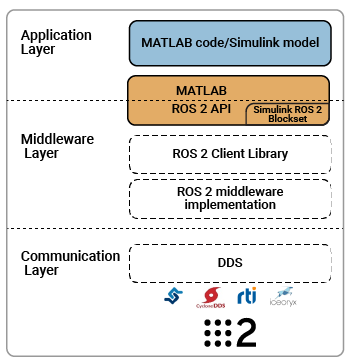
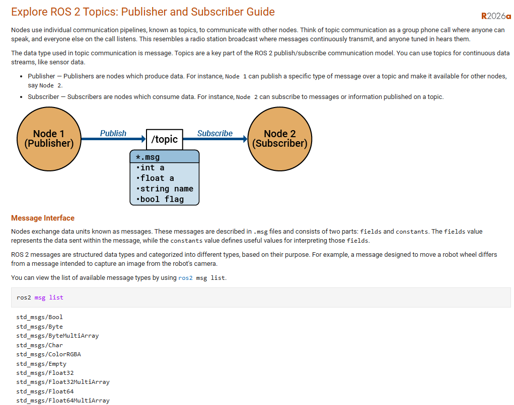
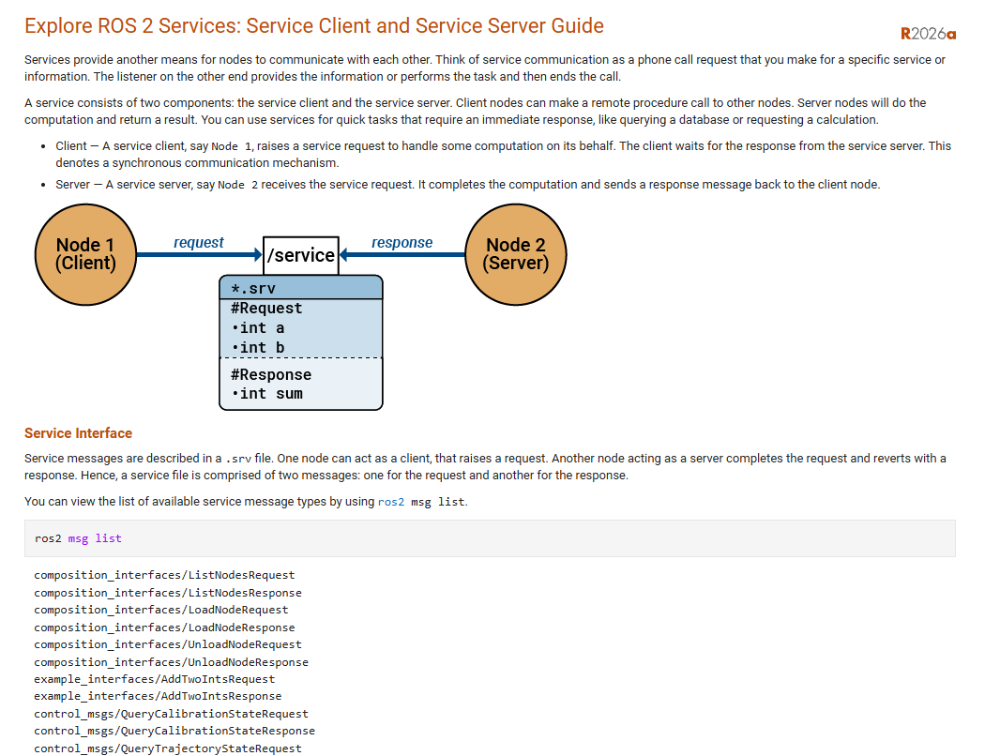
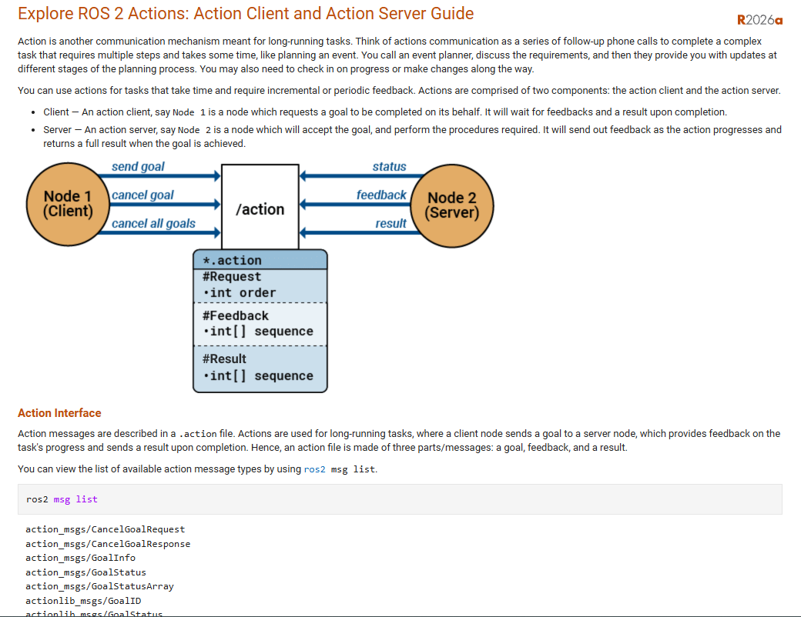

# DDS and ROS2 form `Master ROS2 book'

This diagram shows the ROS2 → DDS → transport layered architecture.



## messages are the center of ROS 2 systems

Why is this graph needed? Refer to ROS toolbox info from mathwoks.



## it uses messages inside all the `/topics'

### Main Concept

`nodes` talk to each other... (nodes are processes)

How? (Using topics, which include multiple messages, services, and actions.)

By using `interface`(s), they are: /topics(`.msg`), /services(`.srv`), and /actions(`.action`) to communicate betwell all node/processes, it is important for a`/topic` to remain clear. So for example, there are `geometry_msgs/`, `map_msgs/`, and many others that is self-explained namewise.

/servies and /actions are also likewise, we'll deal with it later.

Inside the 3 topic kinds (since not everything is to everyone, there are many individual `/topic:(message, srvice, and actions)`s), are organized STURCTURE pre-designed called `/messages` of many kind...

Understand the `/messges`(interface) are very different depending on it's topic.... since even a lidar hardware is communicating lidar signals, and the messege it carries is truely different form the odometry message. This "namespace" contains the "content" idea, and provies the "different ways to carry message to the right processes". 

Thus this leads to the final part of the data structure of the "messages"/"topics"/"interfaces", who may be for example: `sensor_msgs/msg/Image`, `std_msgs/msg/Float32`, and `builtin_interfaces/msg/Duration`. As well as `rosbag2_interfaces/srv/Record`, and `tf2_msgs/action/LookupTransform`.

Don't forget /service and /action type messages... learn more later. Again use

> ros2 interface list

_To check all interfaces. Go to the bottom of this page._

Therefore finally, the /topics of: *MESSAGE, SERVICE, and ACTION* are typed and commonly usedby community re-used `/data_structure` standards. And these data structure are often `array`(s) of `float`, `int`, under the *names of the state of machine*, such as `angular_vel`, and itself is and `array` of `[x, y, z]` by the convention of the community.

The main idea: ([link to namespace](./NameSpace_ROS2.md))

All formal definition of different datatypes, especially vendor sensor signal message type/structure, likewise:

```Text
fieldtype1 fieldname1
fieldtype2 fieldname2
fieldtype3 fieldname3
```

Formal definitions are defined here [link to ros2 tutorial](https://docs.ros.org/en/jazzy/Concepts/Basic/About-Interfaces.html).

Note all the convention of vender and historically practical "cheap and easy" conventions of all kind is to be learned on the job.

## most important referfence on iterfaces

[link from matlab networks](https://www.mathworks.com/help/ros/gs/ros2-nodes.html)

### Basic Topic message interface 

Between nodes, there are usually at least some messages (`.msg`) topic underneeth on the **DDS** network flowing around, and as a node processes goes on-line to work, like in the following figure, Node 1 is going to publish (maintian an anouncer role, make changes to the content), and another Node 2, as needed subscribes to the said topic/message (become a listenner role, takes the content and use it).

The following are a list of messeges used in the ROS2 interface list.
 
[Interface message list](##reference)



### Basic Service interface



### Basic Action interface



## reference

### Message list

Messages:

action messages (flowing underneeth?)

```text
- action_msgs/msg/
    - action_msg/msg/GoalInfo
    - action_msgs/msg/GoalStatus
    - action_msgs/msg/GoalStatusArray
```

Action library messages (flowing underneeth?)

```text
- actionlib_msgs/msg/
    - actionlib_msgs/msg/GoalID
    - actionlib_msgs/msg/GoalStatus
    - actionlib_msgs/msg/GoalStatusArray
```

Built in interface messages (time critical?)

```text
- builtin_interfaces/msg/
    - builtin_interfaces/msg/Duration
    - builtin_interfaces/msg/Time
```

Diagnostic messages (overall error message?)

```text
- diagnostic_msgs/msg/
    - diagnostic_msgs/msg/DiagnosticArray
    - diagnostic_msgs/msg/DiagnosticStatus
    - diagnostic_msgs/msg/KeyValue
```

Example messages (template for modifying or lazy copy?)

- example_interfaces/msg/

<details>
<summary>Click to expand</summary>

```text
    - example_interfaces/msg/Bool
    - example_interfaces/msg/Byte
    - example_interfaces/msg/ByteMultiArray
    - example_interfaces/msg/Char
    - example_interfaces/msg/Empty
    - example_interfaces/msg/Float32
    - example_interfaces/msg/Float32MultiArray
    - example_interfaces/msg/Float64
    - example_interfaces/msg/Float64MultiArray
    - example_interfaces/msg/Int16
    - example_interfaces/msg/Int16MultiArray
    - example_interfaces/msg/Int32
    - example_interfaces/msg/Int32MultiArray
    - example_interfaces/msg/Int64
    - example_interfaces/msg/Int64MultiArray
    - example_interfaces/msg/Int8
    - example_interfaces/msg/Int8MultiArray
    - example_interfaces/msg/MultiArrayDimension
    - example_interfaces/msg/MultiArrayLayout
    - example_interfaces/msg/String
    - example_interfaces/msg/UInt16
    - example_interfaces/msg/UInt16MultiArray
    - example_interfaces/msg/UInt32
    - example_interfaces/msg/UInt32MultiArray
    - example_interfaces/msg/UInt64
    - example_interfaces/msg/UInt64MultiArray
    - example_interfaces/msg/UInt8
    - example_interfaces/msg/UInt8MultiArray
    - example_interfaces/msg/WString
```

</details>

- gerometry_msgs/msg/

<details>
<summary>Click to expand</summary>

```text
    - geometry_msgs/msg/Accel
    - geometry_msgs/msg/AccelStamped
    - geometry_msgs/msg/AccelWithCovariance
    - geometry_msgs/msg/AccelWithCovarianceStamped
    - geometry_msgs/msg/Inertia
    - geometry_msgs/msg/InertiaStamped
    - geometry_msgs/msg/Point
    - geometry_msgs/msg/Point32
    - geometry_msgs/msg/PointStamped
    - geometry_msgs/msg/Polygon
    - geometry_msgs/msg/PolygonInstance
    - geometry_msgs/msg/PolygonInstanceStamped
    - geometry_msgs/msg/PolygonStamped
    - geometry_msgs/msg/Pose
    - geometry_msgs/msg/Pose2D
    - geometry_msgs/msg/PoseArray
    - geometry_msgs/msg/PoseStamped
    - geometry_msgs/msg/PoseWithCovariance
    - geometry_msgs/msg/PoseWithCovarianceStamped
    - geometry_msgs/msg/Quaternion
    - geometry_msgs/msg/QuaternionStamped
    - geometry_msgs/msg/Transform
    - geometry_msgs/msg/TransformStamped
    - geometry_msgs/msg/Twist
    - geometry_msgs/msg/TwistStamped
    - geometry_msgs/msg/TwistWithCovariance
    - geometry_msgs/msg/TwistWithCovarianceStamped
    - geometry_msgs/msg/Vector3
    - geometry_msgs/msg/Vector3Stamped
    - geometry_msgs/msg/VelocityStamped
    - geometry_msgs/msg/Wrench
    - geometry_msgs/msg/WrenchStamped
```

</details>

Lifecycle messages (state machine/node processes?)

```text
- lifecycle_msgs/msg/
    - lifecycle_msgs/msg/State
    - lifecycle_msgs/msg/Transition
    - lifecycle_msgs/msg/TransitionDescription
    - lifecycle_msgs/msg/TransitionEvent
```

Map messages (3D mapping? SLAM?)

```text
- map_msgs/msg/
    - map_msgs/msg/OccupancyGridUpdate
    - map_msgs/msg/PointCloud2Update
    - map_msgs/msg/ProjectedMap
    - map_msgs/msg/ProjectedMapInfo
```

Navigation messages (data onto map to move?)

```text
- nav_msgs/msg/
    - nav_msgs/msg/Goals
    - nav_msgs/msg/GridCells
    - nav_msgs/msg/MapMetaData
    - nav_msgs/msg/OccupancyGrid
    - nav_msgs/msg/Odometry
    - nav_msgs/msg/Path
    - nav_msgs/msg/Trajectory
    - nav_msgs/msg/TrajectoryPoint
```

PCL messages (polygon coefficeint library? map use?)

```text
- pcl_msgs/msg/
    - pcl_msgs/msg/ModelCoefficients
    - pcl_msgs/msg/PointIndices
    - pcl_msgs/msg/PolygonMesh
    - pcl_msgs/msg/Vertices
```

Pendulum messages (viewing robot arm as an inverted pendulum?)

```text
- pendulum_msgs/msg/
    - pendulum_msgs/msg/JointCommand
    - pendulum_msgs/msg/JointState
    - pendulum_msgs/msg/RttestResults
```

RCL interface messages (rclpy, rclc++, rcljava... related nodal parameter?)

- rcl_interface/msg/

<details>
<summary>Click to expand</summary>

```text
    rcl_interfaces/msg/FloatingPointRange
    rcl_interfaces/msg/IntegerRange
    rcl_interfaces/msg/ListParametersResult
    rcl_interfaces/msg/Log
    rcl_interfaces/msg/LoggerLevel
    rcl_interfaces/msg/Parameter
    rcl_interfaces/msg/ParameterDescriptor
    rcl_interfaces/msg/ParameterEvent
    rcl_interfaces/msg/ParameterEventDescriptors
    rcl_interfaces/msg/ParameterType
    rcl_interfaces/msg/ParameterValue
    rcl_interfaces/msg/SetLoggerLevelsResult
    rcl_interfaces/msg/SetParametersResult
```

</details>

ROS 2 middle-ware DDS messages (middle layer coding)

```text
    - rmw_dds_common/msg/Gid
    - rmw_dds_common/msg/NodeEntitiesInfo
    - rmw_dds_common/msg/ParticipantEntitiesInfo
```

ROS Bag message (data loging using bag2 protocal?)

```text
    - rosbag2_interfaces/msg/ReadSplitEvent
    - rosbag2_interfaces/msg/WriteSplitEvent
```

ROS node graph messages (??)

```text
    - rosgraph_msgs/msg/Clock
```

Sensor hardware messeges (from vendor and common)

- sensor_msgs/msg/

<details>
<summary>Click to expand</summary>

```text
    - sensor_msgs/msg/BatteryState
    - sensor_msgs/msg/CameraInfo
    - sensor_msgs/msg/ChannelFloat32
    - sensor_msgs/msg/CompressedImage
    - sensor_msgs/msg/FluidPressure
    - sensor_msgs/msg/Illuminance
    - sensor_msgs/msg/Image
    - sensor_msgs/msg/Imu
    - sensor_msgs/msg/JointState
    - sensor_msgs/msg/Joy
    - sensor_msgs/msg/JoyFeedback
    - sensor_msgs/msg/JoyFeedbackArray
    - sensor_msgs/msg/LaserEcho
    - sensor_msgs/msg/LaserScan
    - sensor_msgs/msg/MagneticField
    - sensor_msgs/msg/MultiDOFJointState
    - sensor_msgs/msg/MultiEchoLaserScan
    - sensor_msgs/msg/NavSatFix
    - sensor_msgs/msg/NavSatStatus
    - sensor_msgs/msg/PointCloud
    - sensor_msgs/msg/PointCloud2
    - sensor_msgs/msg/PointField
    - sensor_msgs/msg/Range
    - sensor_msgs/msg/RegionOfInterest
    - sensor_msgs/msg/RelativeHumidity
    - sensor_msgs/msg/Temperature
    - sensor_msgs/msg/TimeReference
```

</details>

Service messages (underlying flow)

```text
    service_msgs/msg/ServiceEventInfo
```

Shape messages (Rviz and other polygonal geometry math shape? used in sim?)

```text
- shape_msgs/msg/
    - shape_msgs/msg/Mesh
    - shape_msgs/msg/MeshTriangle
    - shape_msgs/msg/Plane
    - shape_msgs/msg/SolidPrimitive
```

Statistics messages (math use? internal D-H table messages?)

```test
- statistics_msgs/msg/
    - statistics_msgs/msg/MetricsMessage
    - statistics_msgs/msg/StatisticDataPoint
    - statistics_msgs/msg/StatisticDataType
```

Standard messages (by computer programming type def)

- std_msgs/msg/

<details>
<summary>Click to expand</summary>

```text
    - std_msgs/msg/Bool
    - std_msgs/msg/Byte
    - std_msgs/msg/ByteMultiArray
    - std_msgs/msg/Char
    - std_msgs/msg/ColorRGBA
    - std_msgs/msg/Empty
    - std_msgs/msg/Float32
    - std_msgs/msg/Float32MultiArray
    - std_msgs/msg/Float64
    - std_msgs/msg/Float64MultiArray
    - std_msgs/msg/Header
    - std_msgs/msg/Int16
    - std_msgs/msg/Int16MultiArray
    - std_msgs/msg/Int32
    - std_msgs/msg/Int32MultiArray
    - std_msgs/msg/Int64
    - std_msgs/msg/Int64MultiArray
    - std_msgs/msg/Int8
    - std_msgs/msg/Int8MultiArray
    - std_msgs/msg/MultiArrayDimension
    - std_msgs/msg/MultiArrayLayout
    - std_msgs/msg/String
    - std_msgs/msg/UInt16
    - std_msgs/msg/UInt16MultiArray
    - std_msgs/msg/UInt32
    - std_msgs/msg/UInt32MultiArray
    - std_msgs/msg/UInt64
    - std_msgs/msg/UInt64MultiArray
    - std_msgs/msg/UInt8
    - std_msgs/msg/UInt8MultiArray
```

</details>

Stereo messages (fourier transform 2/3D phase difference diagram?)

```text
    - stereo_msgs/msg/DisparityImage
```

Tranform messages (transform/controller block idea?'s signal phase/db?)

```text
    - tf2_msgs/msg/TF2Error
    - tf2_msgs/msg/TFMessage
```

Basic Trajectory messages (robot arm trajectory? joint angle discription?)

```text
    - trajectory_msgs/msg/JointTrajectory
    - trajectory_msgs/msg/JointTrajectoryPoint
    - trajectory_msgs/msg/MultiDOFJointTrajectory
    - trajectory_msgs/msg/MultiDOFJointTrajectoryPoint
```

Turtlesim tutorial default messages (tutorial practrice, may be used into rviz extensively...)

```text
    - turtlesim/msg/Color
    - turtlesim/msg/Pose
```

Type description interface messages (lower level flags?)

```text
    - type_description_interfaces/msg/Field
    - type_description_interfaces/msg/FieldType
    - type_description_interfaces/msg/IndividualTypeDescription
    - type_description_interfaces/msg/KeyValue
    - type_description_interfaces/msg/TypeDescription
    - type_description_interfaces/msg/TypeSource
```
Unique identifyer message (for node use? for NETWORK commnunication?)

```text
    - unique_identifier_msgs/msg/UUID
```

Visualization messages (for what? GUI/CLI interaction? or on map?)

- visualization_msgs/msg/

<details>
<summary>Click to expand</summary>

```text
    - visualization_msgs/msg/ImageMarker
    - visualization_msgs/msg/InteractiveMarker
    - visualization_msgs/msg/InteractiveMarkerControl
    - visualization_msgs/msg/InteractiveMarkerFeedback
    - visualization_msgs/msg/InteractiveMarkerInit
    - visualization_msgs/msg/InteractiveMarkerPose
    - visualization_msgs/msg/InteractiveMarkerUpdate
    - visualization_msgs/msg/Marker
    - visualization_msgs/msg/MarkerArray
    - visualization_msgs/msg/MenuEntry
    - visualization_msgs/msg/MeshFile
    - visualization_msgs/msg/UVCoordinate
```

</details>

### Service list

Services: A request to do something, in message/topic form go around

Action service messages (a request to cancel action?)

```text
    - action_msgs/srv/CancelGoal
```

ROS 2 system nodal graph service request message (show/load/unload node?)

```text
    - composition_interfaces/srv/ListNodes
    - composition_interfaces/srv/LoadNode
    - composition_interfaces/srv/UnloadNode
```

Diagnosis service resuest message (to ask for self-diagnosis?)

```text
    - diagnostic_msgs/srv/AddDiagnostics
    - diagnostic_msgs/srv/SelfTest
```

Basic example service request (one-time command ask nodes who listen in for an change of some thing?)

```text
    - example_interfaces/srv/AddTwoInts
    - example_interfaces/srv/SetBool
    - example_interfaces/srv/Trigger
```

Nodal/message lifecycle service request (to make sure some state machine responses to this query?)

```text
    - lifecycle_msgs/srv/ChangeState
    - lifecycle_msgs/srv/GetAvailableStates
    - lifecycle_msgs/srv/GetAvailableTransitions
    - lifecycle_msgs/srv/GetState
```

log demostration service message (to make a request to configure loging things?)

```text
    - logging_demo/srv/ConfigLogger
```

Map services messages (request to act on map? learn map how to use)

```text
    - map_msgs/srv/GetMapROI
    - map_msgs/srv/GetPointMap
    - map_msgs/srv/GetPointMapROI
    - map_msgs/srv/ProjectedMapsInfo
    - map_msgs/srv/SaveMap
    - map_msgs/srv/SetMapProjections
```

Navigation service message (request to get something about map? note trajectory topic/messages previously?)

```text
    - nav_msgs/srv/GetMap
    - nav_msgs/srv/GetPlan
    - nav_msgs/srv/LoadMap
    - nav_msgs/srv/SetMap
```

PCL message service request (only one filename update, so may be PC local?)

```text
    - pcl_msgs/srv/UpdateFilename
```
Ros Client Library (important!) service message (node related!!!)

*Note parameters are requested here!!!*

```text
    - rcl_interfaces/srv/DescribeParameters
    - rcl_interfaces/srv/GetLoggerLevels
    - rcl_interfaces/srv/GetParameterTypes
    - rcl_interfaces/srv/GetParameters
    - rcl_interfaces/srv/ListParameters
    - rcl_interfaces/srv/SetLoggerLevels
    - rcl_interfaces/srv/SetParameters
    - rcl_interfaces/srv/SetParametersAtomically
```
ROS bag service request message (check how `bags` are handled?)

- rosbag2_interfaces/srv/

<details>
<summay>Click to expand</summary>

```text
    - rosbag2_interfaces/srv/Burst
    - rosbag2_interfaces/srv/GetRate
    - rosbag2_interfaces/srv/IsDiscoveryRunning
    - rosbag2_interfaces/srv/IsPaused
    - rosbag2_interfaces/srv/Pause
    - rosbag2_interfaces/srv/Play
    - rosbag2_interfaces/srv/PlayNext
    - rosbag2_interfaces/srv/Record
    - rosbag2_interfaces/srv/Resume
    - rosbag2_interfaces/srv/Seek
    - rosbag2_interfaces/srv/SetRate
    - rosbag2_interfaces/srv/Snapshot
    - rosbag2_interfaces/srv/SplitBagfile
    - rosbag2_interfaces/srv/StartDiscovery
    - rosbag2_interfaces/srv/Stop
    - rosbag2_interfaces/srv/StopDiscovery
    - rosbag2_interfaces/srv/TogglePaused
```

</details>

Sensor service request message (only on camera, others seem to be `publisher`)

```text
    sensor_msgs/srv/SetCameraInfo
```

Standard service request messages (seems like only type def?)

```text
    std_srvs/srv/Empty
    std_srvs/srv/SetBool
    std_srvs/srv/Trigger
```

Transform Framework 2 service request message (need to learn convention)

```text
    tf2_msgs/srv/FrameGraph
```
Turtle sim tutorial service request message (more like topic specific for turtle sim)

```text
    turtlesim/srv/Kill
    turtlesim/srv/SetPen
    turtlesim/srv/Spawn
    turtlesim/srv/TeleportAbsolute
    turtlesim/srv/TeleportRelative
```
Type description interface standard service request message (special?)

```text
    type_description_interfaces/srv/GetTypeDescription
```

Visualization service request message (check visulization in "message" list)

```text
    visualization_msgs/srv/GetInteractiveMarkers
```

### Action list

Actions:

```text
    - action_tutorials_interfaces/action/Fibonacci
    - example_interfaces/action/Fibonacci
    - tf2_msgs/action/LookupTransform
    - turtlesim/action/RotateAbsolute
```

## There is no turtle1/cmd_vel

This is a /topic!!! But some `messages`, `service` is there in our interface list!!!

This user-defined "message" like sturcture is a channel, the system operator made, so that it composes of "serval messages" to become one topic!!! that the nodes talk to each other!!

it looks like message/service/action, but no! it is a *TOPIC*

*Topics* are defined by user.... however, there are already many `conventional topics` that everyone uses, my goal here is to learn them, as they `re-use` alot of these command, dh, robot tree and many others....

> un-well defined but overall dominating robot topics is something to learn how all rviz gazebo has already pre-assume one know, through MATLAB robotics toolbox, as most grow out of there...

---
