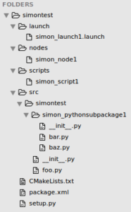
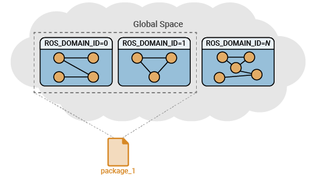
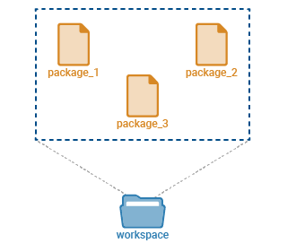

# What is a ROS 2 package?
this leads to topics, messges and workspaces...
*Peter Chang*

## Using a directory (folder) full of files, that runs the ros2 pkg command

Typically, a ROS 2 package comprises nodes (programs that execute computations), libraries, configuration files, launch files, and other resources such as message and service definitions.

Everything in ROS 2 is modeled inside a package. A package is simply a folder that we can create using the ros2 pkg command, and it will have files such as `package.xml`, `CMakeLists.txt`, and so on to keep the identity of the package. The information, such as the package’s name, dependencies of the package, and so on, will be included in these files.

## Core packages already there

When we install ROS 2, we will get its core packages by default. We will also get tons of ROS 2 packages from the community. These packages are easily redistributed via Git or can be added to ROS 2 official repos, and you can install their binaries.

A useful feature of ROS 2 is that it is easy to reuse the packages built by other developers in your robot. Each package is created for specific applications. For example, the demo_nodes_cpp package in ROS 2 contains ROS 2 C++ examples.

Packages in ROS 2 serve as modular units for organizing and sharing code. Packages comprise of source code, configuration files, and documentation, promoting code reuse and maintainability. To manage and build these packages effectively, ROS 2 employs `colcon`, a build tool specifically crafted for ROS 2 projects.

A workspace is a directory containing ROS 2 packages. Workspaces provide a structured hierarchy, ensuring that packages are organized effectively. A single workspace can contain several packages, each in their own folder.

## parameters, nodes, and messeges

